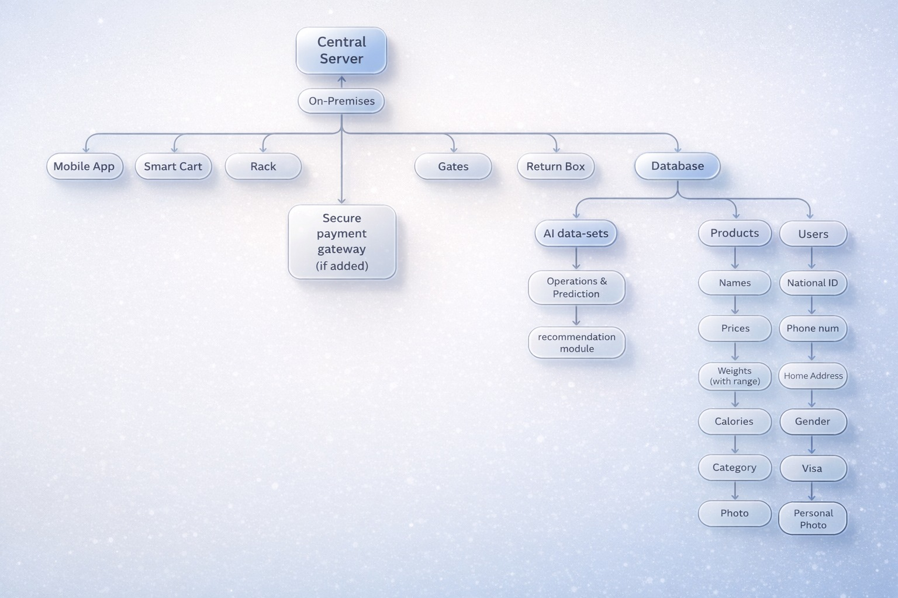

<!-- ===================== -->
<!-- LEAD -->
<!-- ===================== -->

<section class="lead">

# Is it really worth it?

A simple question — before we begin.

</section>

---

## The Familiar Pain

- Checkout lines wrapping around aisles  
- Searching endlessly for one product  
- Discovering it’s out of stock  
- Or something worse  

---

## From the Store’s Perspective

Imagine discovering your store lost

$2.2M

in a single year to theft alone.

---

<section class="lead">

## You’re not alone

And that’s why we’re here today.

</section>

---

<section class="lead">

# A Retail Paradox

</section>

---

## Online Shopping Has Exploded

Fast.  
Convenient.  
One click away.

<strong>Yet…</strong>

---

## Millions Still Visit Physical Stores

They want to:

- Feel products  
- Check freshness  
- Read expiration dates  
- Experience shopping physically  

---

<section class="lead">

## The Problem?

# The in-store experience is broken

And it has been for decades.

</section>

---

<section class="lead">

# Problem 1  
## The Queue Nightmare

</section>

---

## Checkout Reality

- Average checkout: **4–5 minutes**  
- Hundreds of customers daily  
- Dozens of cashiers  

<strong>Millions of hours wasted.</strong>

---

## Why Queues Exist

- Outdated barcode scanning  
- Manual price checks  
- One item at a time  
- Human bottlenecks  

---

## Everyone Pays the Price

- Billions spent on inefficient labor  
- Abandoned carts  
- Lost revenue  
- Frustrated customers  

---

<section class="lead">

# Problem 2  
## The Availability Crisis

</section>

---

## The Dinner Scenario

- You need one ingredient  
- Walk aisle to aisle  
- Spend 15 minutes searching  
- Ask for help  

---

<blockquote>
“Sorry, we just sold out.”
</blockquote>

---

<section class="lead">

# Problem 3  
## The Lack of Security

</section>

---

## A Number That Matters

$112B

Lost to shoplifting in the U.S. (2023)

---

## Theft Isn’t Always Obvious

- Items not scanned  
- Internal theft  
- Register errors  
- Return fraud  

---

<section class="lead">

The modern supermarket runs on a

# 20th-century model

Trying to serve  
<strong>21st-century customers</strong>

</section>

---

<section class="lead">

# We Built  
## Something Different

</section> 

---
## Our Vision

### Three Powerful Forces

- *Computer Vision & AI*
- *Seamless Mobile Experience*
- *Real-Time Backend Infrastructure*
---
<section class="lead">

# A New Reality

</section>

---

<section class="lead">

# Seamless Entry

The journey begins with a single scan.

</section>

---

## The Check-in

- **Launch** 
- **Sync** 
- **Connect** 

---

<section class="lead">

# Intelligent Shopping

The cart becomes your personal assistant.

</section>

---

## How it Works

    
<strong>Gravity</strong> Weight sensors confirm the choice

  
<strong>Vision</strong> AI cameras identify every item

  
<strong>Display</strong> Live total and smart suggestions

---

## Pure Frictionless Flow

- **Automatic Updates:** The digital cart tracks every move in real-time.
- **The Return Box:** Place unwanted items in the dedicated bin to instantly deduct them from your bill.
- **Natural Interaction:** No searching for barcodes. No manual scanning. Just pick and go.

---

<section class="lead">

#  Instant Checkout

We put an end for the queue.

</section>

---

## One-Tap Payment

- **Review**
- **Pay**
- **Feel The Flexibility**

The payment happens where you stand—not at a counter.

---

<section class="lead">

#  Smart Exit

Verification without the wait.

</section>

---

## The Open Door

- **Approach:** Move toward the smart exit lanes.
- **Verify:** Sensors confirm your paid transaction wirelessly.
- **Depart:** The gates open automatically as you walk through.

---

<section class="lead">

The result is a retail experience defined by

# The Two Zeros
## Zero Queues. Zero Errors.

</section>

---

---

